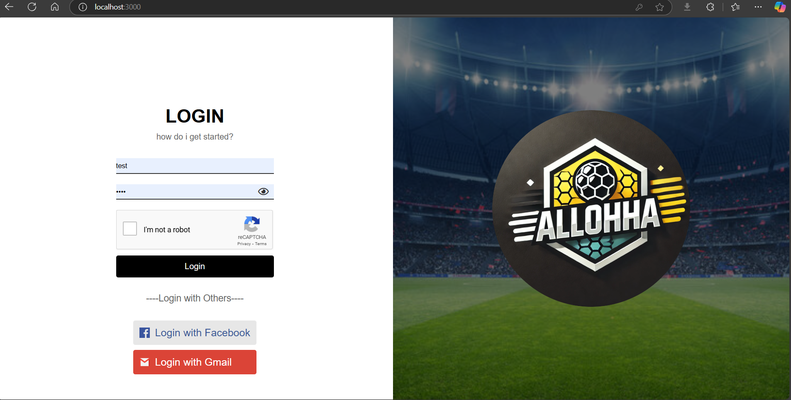
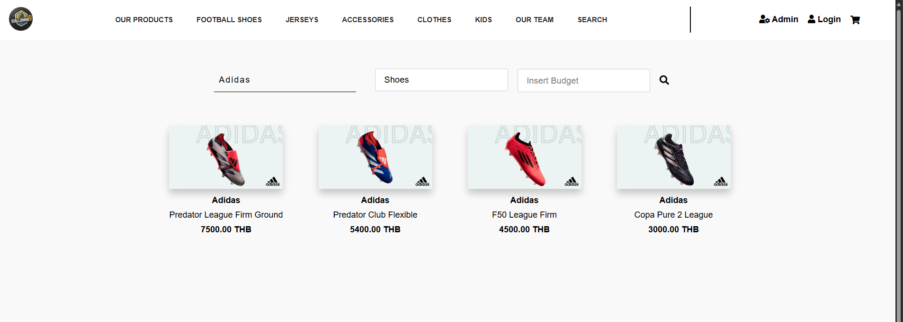
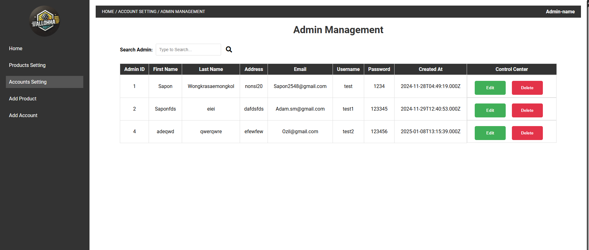
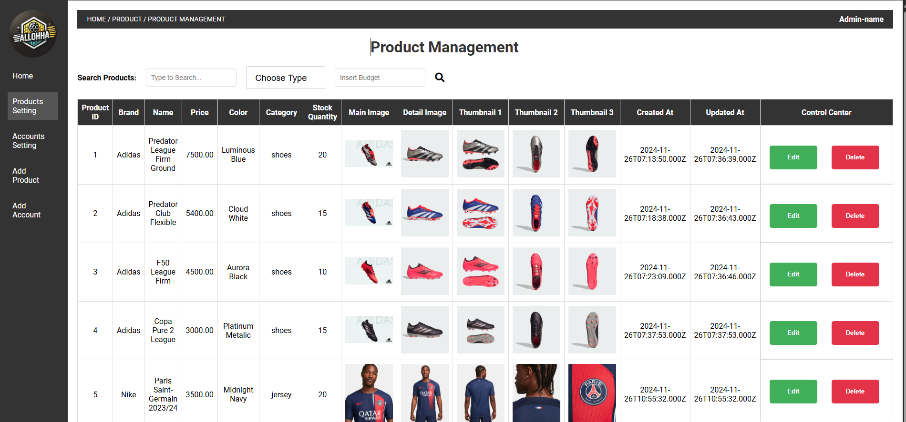
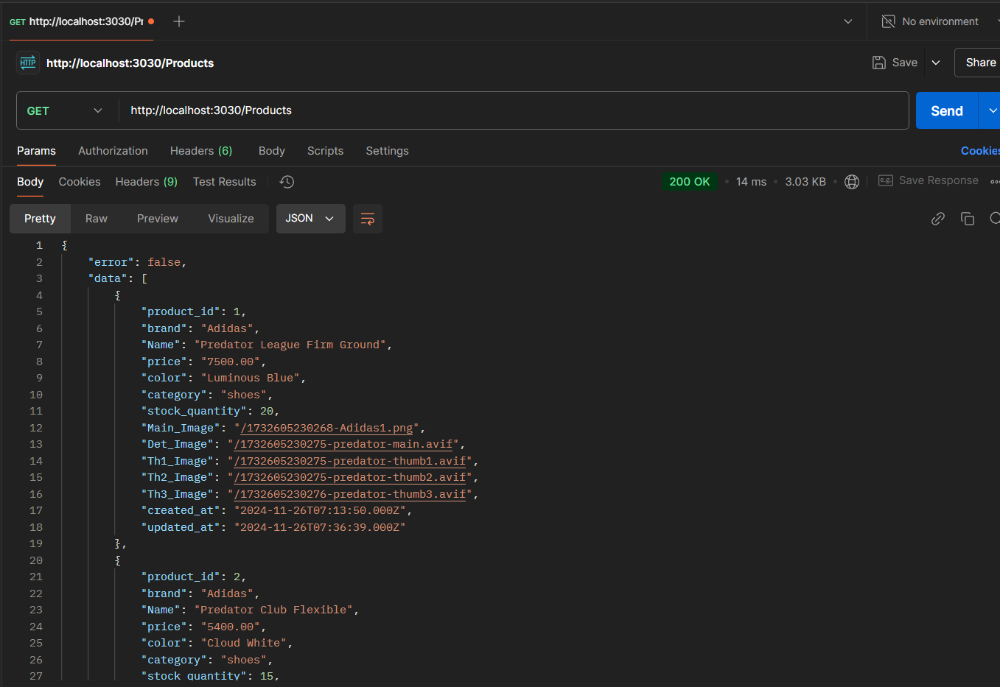

# Project web using html css js node.js and MySQL
อันนี้เป็นโปรเจคในรายวิชาเว็บที่ผมเป็นคนทำแทบทั้งหมดเลยครับ ซึ่งได้มีการใช้ ChatGPT รวมถึงค้นหาใน Google ในการช่วยทำ Project นี้ครับ แต่ผ่านการ review code ด้วยตัวเองแล้วครับ
## ตัวอย่างบางส่วนพร้อมคำอธิบายในหน้าต่างๆครับ
อันนี้จะเป็นหน้า login ที่มีการเช็ค username และ password ที่มีใน database ครับ และก็จะมีการใช้ API reCAPTCHA ของ Google เพื่อเช็คว่าเป็นคนไหมด้วยครับ

## Home Page

## Search Page

## Back-end Pages (Accounts and Products)

## Ex. Test API via Postman

